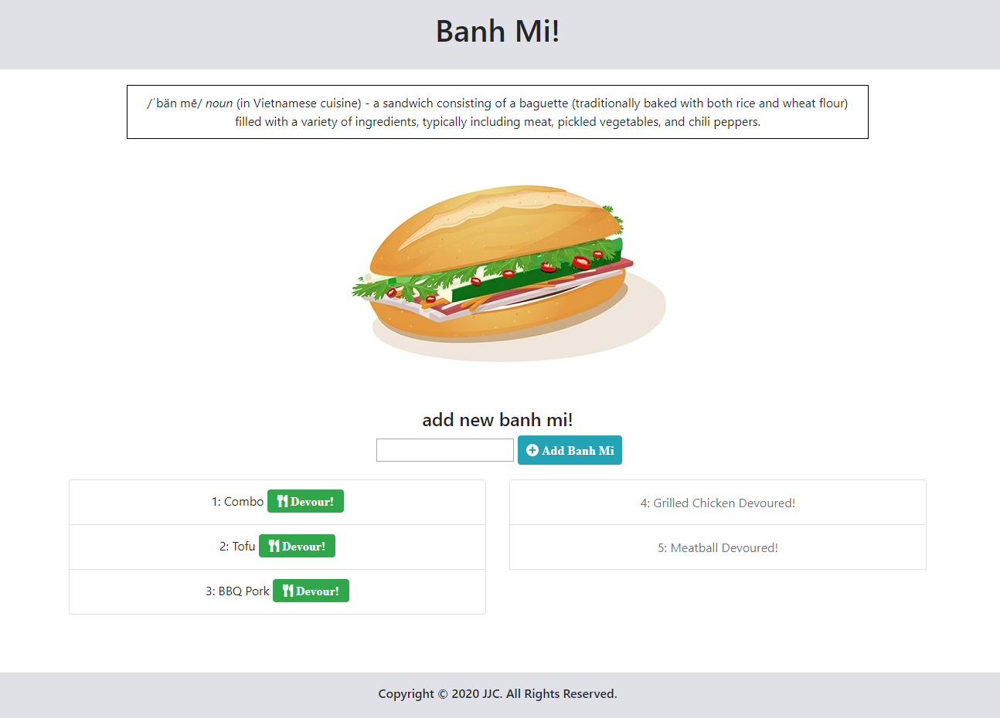

# Homework 13 - Banh Mi Log

The aim of this project is to create a Node Express app, using a mySQL database and Handlebars to serve the html page. This app follows the MVC (Model-View-Controller) design pattern and utilizes ORM (Object-Relational Mapping).

## User Story

```
As a banh mi (vietnamese sandwich) aficionado 
I want to be able to record and manage banh mi
So that I can organize my list of banhmi varieties, and track ones I've eaten.

```

## Composition of Application

Once deployed, the app allows users to add names of banh mi, which renders them on the left side of the page along with a "devour" button. Once the devour button is clicked, it will move the banh mi entry to the right side of the page. 

The mySQL database is updated with each action. 

## Process

I followed the MVC design to first set up the folder structure (config, controllers, db, models, public, views, etc.). I then created the standard server.js, connection.js and sql files, and worked on the ORM, models js and controller files. The front end javascript and handlebars also were fleshed out in order to test the application further. The "Cats App" activity was used as a reference.    

The dependencies for the application are listed in the package.JSON file and a gitignore file is used to to skip and prevent upload of the node_modules folder to GitHub. 

The password for the mySQL connection is stored on a separate pw.js file and included in the gitignore file to prevent upload to GitHub. 

Heroku deployment required the setup of a JawsDB remote database. Procfile was also added to the root directory to resolve Heroku "cannot find module server.js" error.

## Deployment

The completed application is available for download on Github: 
https://github.com/jenjch/banhMiLog

Image of the application:



The deployed application is hosted on Heroku:
https://blooming-wildwood-86554.herokuapp.com/

The application is also linked to from my portfolio site: https://jenjch.github.io/updatedPortfolio/portfolio.html 

## Acceptance Criteria

I believe I have met all requirements for the application. Feedback on improvements is appreciated.

## License

MIT license Copyright (c) 2020 Jenny Chen 
https://choosealicense.com/licenses/mit/ 